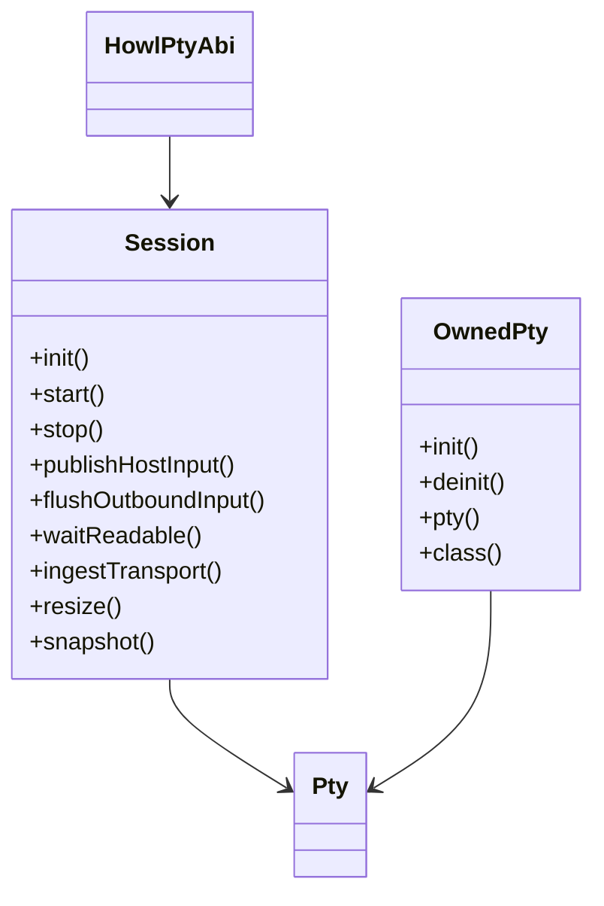
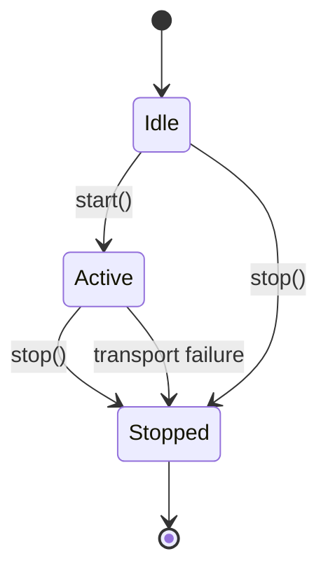
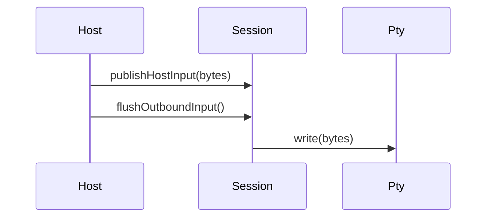
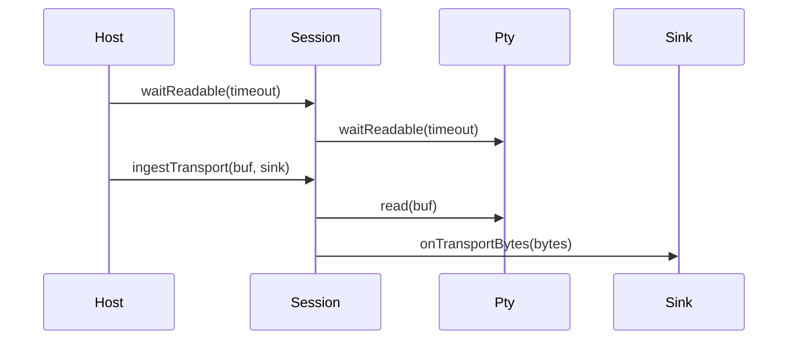

# Design

Shared rules: [`../design/design-rules.md`](../design/design-rules.md)

## Purpose
`howl-pty` owns PTY-backed child transport orchestration.

It does not model terminal semantics. It owns queueing, transport start and stop, transport reads and writes, resize propagation, and transport selection.

## Public Surface
- The only shipped embedding contract is `include/howl_pty.h` plus `howl_pty_*` exported symbols.
- The only public root that may export that contract is `src/libhowl_pty.zig`.
- Opaque session handles plus typed status, snapshot, pump, and read structs are the public ABI.
- `src/howl_pty.zig` is not an embedding surface. If it survives, it is repo-local only.
- Internal workspace wiring is not a public contract and is not a preservation target.
- Deletion targets for the current cleanup are exact:
  - `src/session_namespace.zig`
  - the Zig-shaped host facade posture in `src/pty.zig`
  - the Zig-shaped aggregation posture in `src/howl_pty.zig`

## Ownership Rules
- `Session` owns pending outbound input, current size, lifecycle state, and transport-facing counters.
- `OwnedPty` owns the concrete selected PTY implementation and cleanup.
- `Session` talks to the abstract `Pty` interface only.
- Test PTY variants are exported for conformance testing only.
- Concrete platform PTY implementations stay internal to `howl-pty`; hosts consume `OwnedPty` or `Pty`, not `UnixPty`/`AndroidPty` directly.

## Lifecycle

## Main Flows
### Host Input To PTY

### PTY Output To Host Consumer

## API Contracts
- `howl_pty_session_init` returns an opaque owned session handle; callers must eventually call `howl_pty_session_deinit`.
- `howl_pty_session_start`, `howl_pty_session_stop`, `howl_pty_session_wait_readable`, and `howl_pty_session_read` cover the host transport lifecycle and read path.
- `howl_pty_session_publish_input`, `howl_pty_session_publish_input_and_pump`, `howl_pty_session_pump_outbound`, and `howl_pty_session_has_backlog` cover outbound host input progress.
- `howl_pty_session_pending_bytes` and `howl_pty_session_bytes_applied` expose bounded transport accounting to hosts.
- `howl_pty_session_resize` and `howl_pty_session_snapshot` cover geometry and state observation.
- Hosts and embedders consume that ABI through the header and exported symbols only.
- Zig root imports are not an acceptable host integration path and are not a preservation target.
- `initPty` returns an owned transport; callers must eventually call `deinit` on that owner.
- `Session.init` does not start the transport.
- `Session.attachPty` and `Session.detachPty` are the supported transport replacement hooks while inactive.
- `start` transitions to active and starts the transport if present.
- `publishControlSignal` accepts a typed `ControlSignal`, not a raw signal byte.
- `publishHostInput` only queues bytes; `flushOutboundInput` performs writes.
- `resize` updates tracked geometry and forwards to transport.
- Transport failures move the session to `stopped`.

## Non-Goals
- Terminal parsing or screen state.
- Font or rendering concerns.
- Host event loops.

## Change Rules
- Keep the embedding boundary C ABI first in docs, roots, and build wiring.
- Delete wrapper namespace roots instead of preserving parallel Zig public stories.
- Concrete PTY implementations must stay behind `OwnedPty` and `Pty`.
- Queue policy belongs in `Session`, not in hosts.
- New transport variants should preserve the same owner/interface split.
