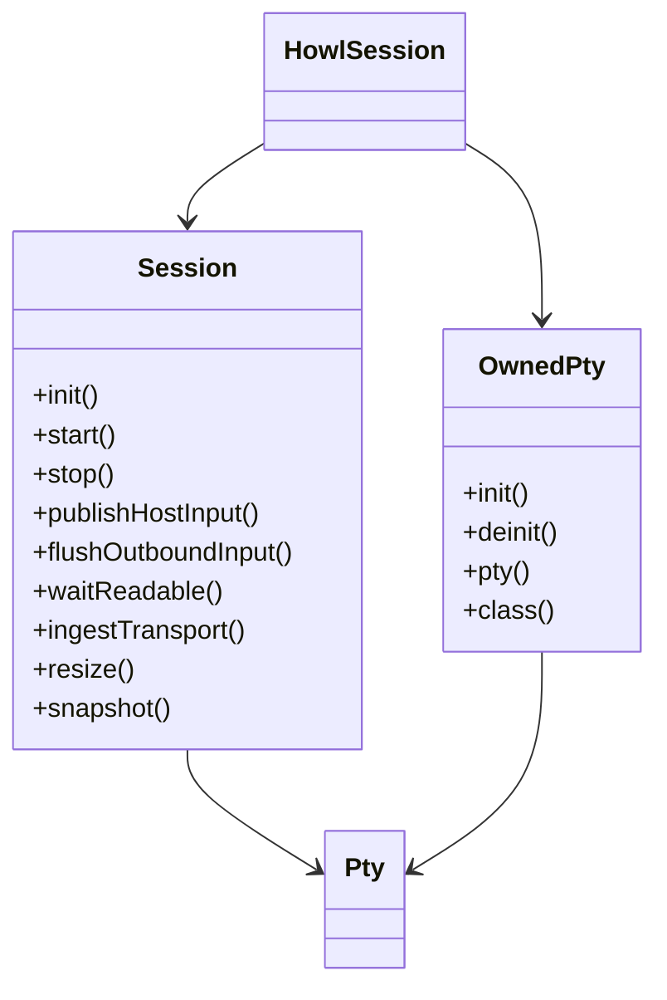
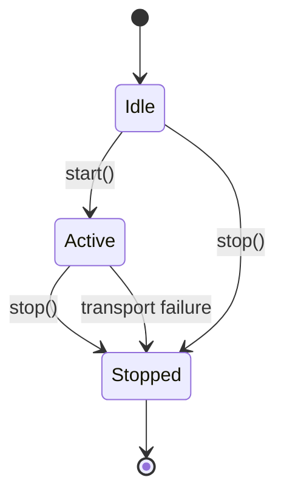
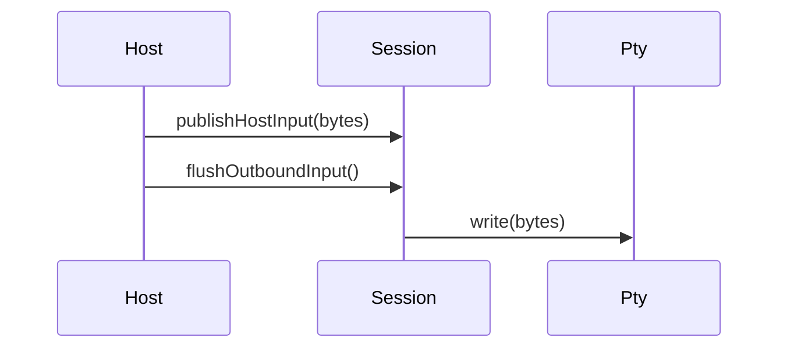
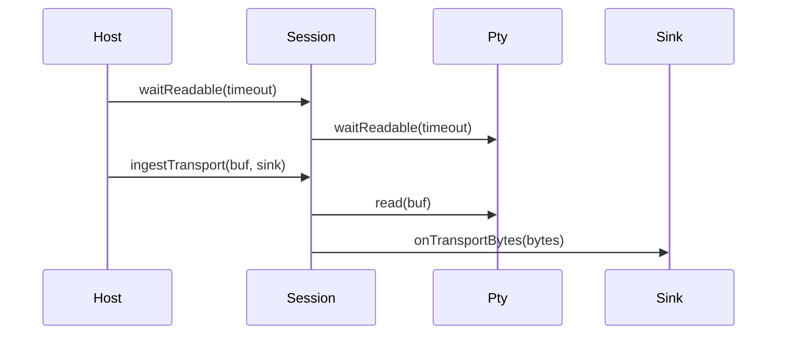

# Design

Shared rules: [`../design/design-rules.md`](../design/design-rules.md)

## Purpose
`howl-session` owns terminal session I/O orchestration around a PTY transport.

It does not model terminal semantics. It owns queueing, transport start/stop, transport reads/writes, resize propagation, and transport selection.

## Public Surface
- `HowlSession`: package owner.
- `Session`: queue/lifecycle owner.
- `OwnedPty`: build-selected PTY owner.
- `Pty`: transport interface contract.
- `ControlSignal`: typed control signal vocabulary for the PTY boundary.

## Ownership Rules
- `Session` owns pending outbound input, current size, lifecycle state, and transport-facing counters.
- `OwnedPty` owns the concrete selected PTY implementation and cleanup.
- `Session` talks to the abstract `Pty` interface only.
- Test PTY variants are exported for conformance testing, not as host architecture.
- Concrete platform PTY implementations stay internal to `howl-session`; hosts consume `OwnedPty` or `Pty`, not `UnixPty`/`AndroidPty` directly.

## Lifecycle

## Main Flows
### Host Input To PTY

### PTY Output To Host Consumer

## API Contracts
- `initPty` returns an owned transport; callers must eventually call `deinit` on that owner.
- `Session.init` does not start the transport.
- `Session.attachPty` and `Session.detachPty` are the supported transport replacement hooks while inactive.
- `start` transitions to active and starts the transport if present.
- `publishControlSignal` accepts a typed `ControlSignal`, not a raw signal byte.
- `publishHostInput` only queues bytes; `flushOutboundInput` performs writes.
- `resize` updates tracked geometry and forwards to transport.
- Transport failures move the session to `stopped`.

## Non-Goals
- Terminal parsing or screen state.
- Font or rendering concerns.
- Host event loops.

## Change Rules
- Concrete PTY implementations must stay behind `OwnedPty` and `Pty`.
- Queue policy belongs in `Session`, not in hosts.
- New transport variants should preserve the same owner/interface split.
